# Basisproject API Development
###### door Wim Adriaensen
## Beschrijving
### Gekozen thema
Het gekozen thema voor mijn API is een soort van Thomas More lessenrooster, waarbij je vakken en docenten kan koppelen in lessen voor een bepaalde richting.
Zo werk ik met een database voor deze API met een tabel voor de vakken (Courses), de docenten (Lecturers) en de lessen (Lessons). Het ERD ziet er als volgt uit.
 
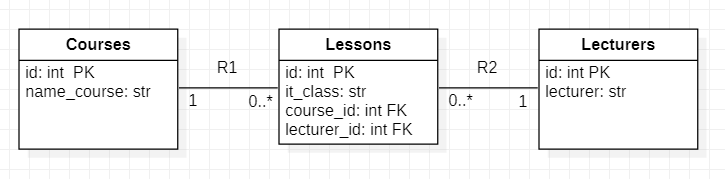
 
In de tabel Courses zitten de vakken, in de tabel Lecturers zitten de docenten en in de tabel Lessons worden de vakken aan de docenten gekoppeld en voor welke richting (it_class) deze voorzien is (nog zonder datum en tijd).

#### Links

| Description | Link |
| --- | --- |
| Hosted API | https://api-wimadriaensen.cloud.okteto.net/ |
| Hosted front-end | https://wimadriaensen.github.io | |
| Repository front-end | https://github.com/WimAdriaensen/wimadriaensen.github.io |
 

### De front-end
De front-end ziet er als volgt uit.
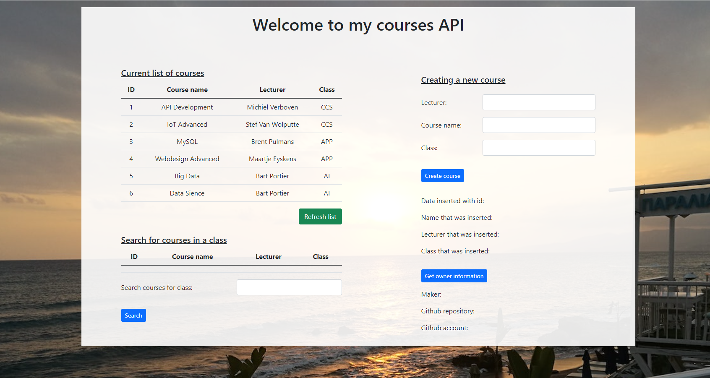
Bij het laden van de pagina vraagt hij aan de API de huidige lijst van vakken, deze word dan ook getoond op de pagina. onderaan staat een knop 'Refresh' om opnieuw de lijst op te vragen bij de API.   

Onder de lijst met vakken vind je een lege tabel terug, in deze tabel komen de vakken te staan die je per richting (of klas) vraagt aan de API. Door in het lege veld de richting in te vullen waarvan je de vakken wil zien en vervolgens op de knop 'Search' drukt worden de vakken van deze richting bij de API opgevraagd.   

Aan de rechterzijde van de pagina kan je een nieuw vak toevoegen door de docent, de naam van het vak en de richting waarin dit vak gegeven word mee te geven aan de API. Door op 'Create course' te drukken worden deze waardes meeggeven aan de API via een POST request. De gegevens die door de API zijn toegevoegd worden daaronder nog eens in het vet weergegeven.  
(Het 'ID' moet niet meegegeven worden, dit word automatisch ingevuld).  

Daaronder vind u een knop 'Show maker information', deze knop spreekt de API van github aan en vraagt de Github gegevens op van de eigenaar (ik). Hij geeft de accountnaam van de eigenaar van de Github repository weer als ook de link naar zijn Github account en de link naar de repository.
 

# Werking API via Postman

#### Hier zijn enkele screenshots met de werking van de API met de applicatie Postman.  

 

### GET-request 1
De eerste screenshot is een GET-request van '/courses', deze vraagt de huidige lijst op van vakken.
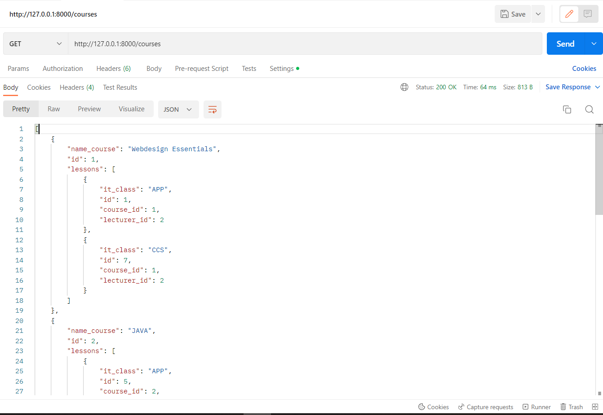
 

### GET-request 2
De volgende screenshot is opnieuw een GET-request, ditmaal van '/courses/{it_class}'. Deze vraagt aan de API om alle vakken te geven die horen bij een bepaalde richting (it_class). 
Hier heb ik gevraagd om alle vakken te geven van de richting AI.
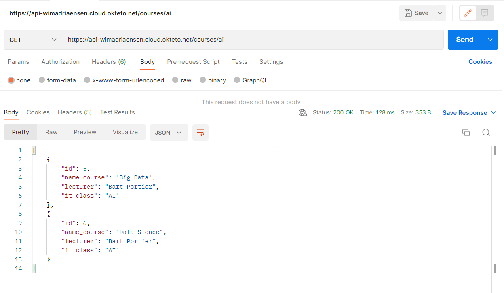
 

### GET-request 3
De Derde screenshot is een GET-request van '/maker' die een externe API aanspreekt, namelijk de API van Github. 
Van de Github-API vraag ik de gegevens op van deze repository, hieruit haal ik dan de username van de eigenaar, de link naar het Githubaccount van de eigenaar en de link naar de repository van mijn API.
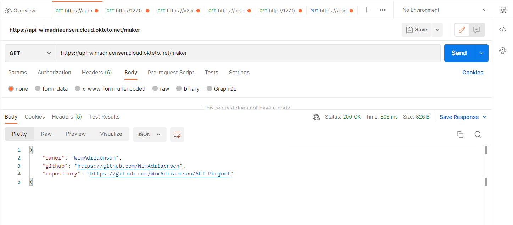
  

### POST-request
De voorlaatste screenshot is een POST-request waarmee je een nieuw vak kan toevoegen op '/courses'.
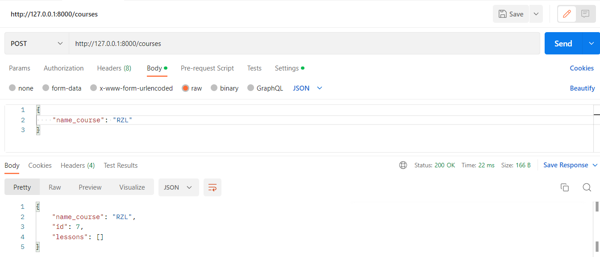
 

De laaste screenshot is opnieuw van de GET-request '/courses' om aan te tonen dat het nieuwe vak is toegevoegd.
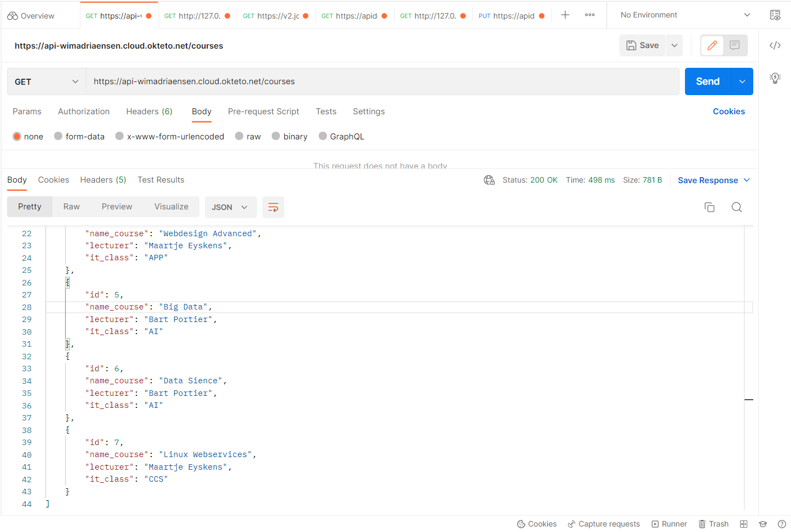
 

# Docs
#### Hier worden er enkele screenshots getoond van de endpoint '/docs' van de API.
link: https://api-wimadriaensen.cloud.okteto.net/docs
  

### Screenshot docs

 

### Screenshot GET /courses
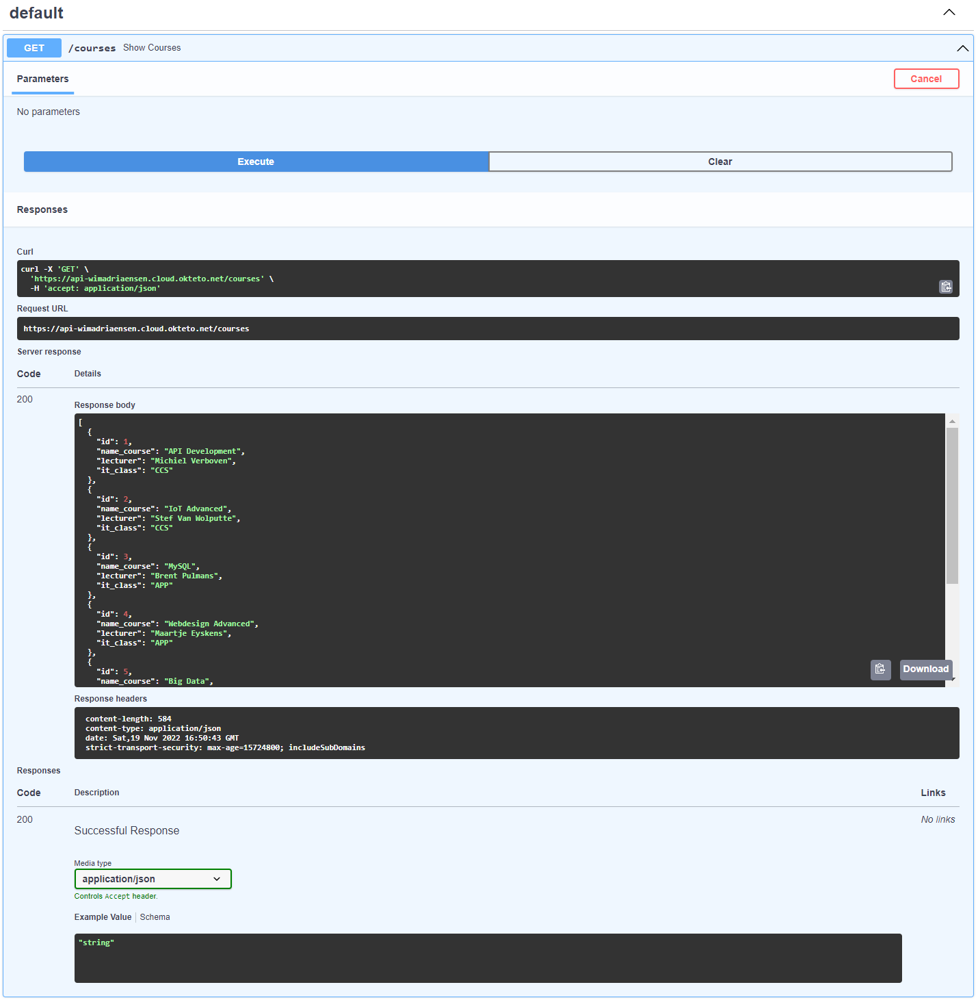
 

### Screenshot POST /courses
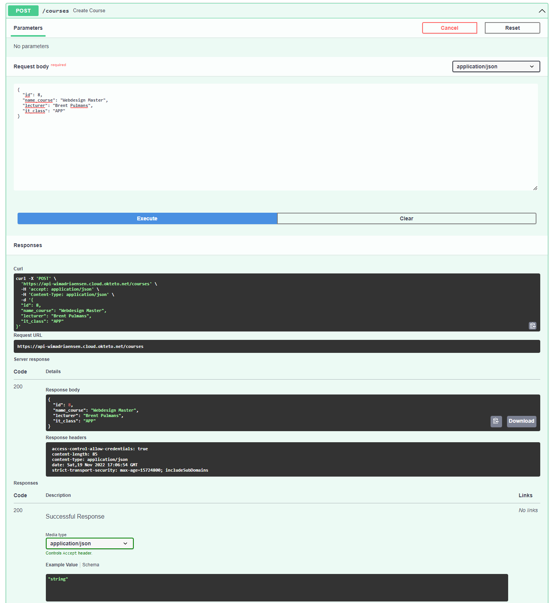
 

### Screenshot GET /courses/{it_class}
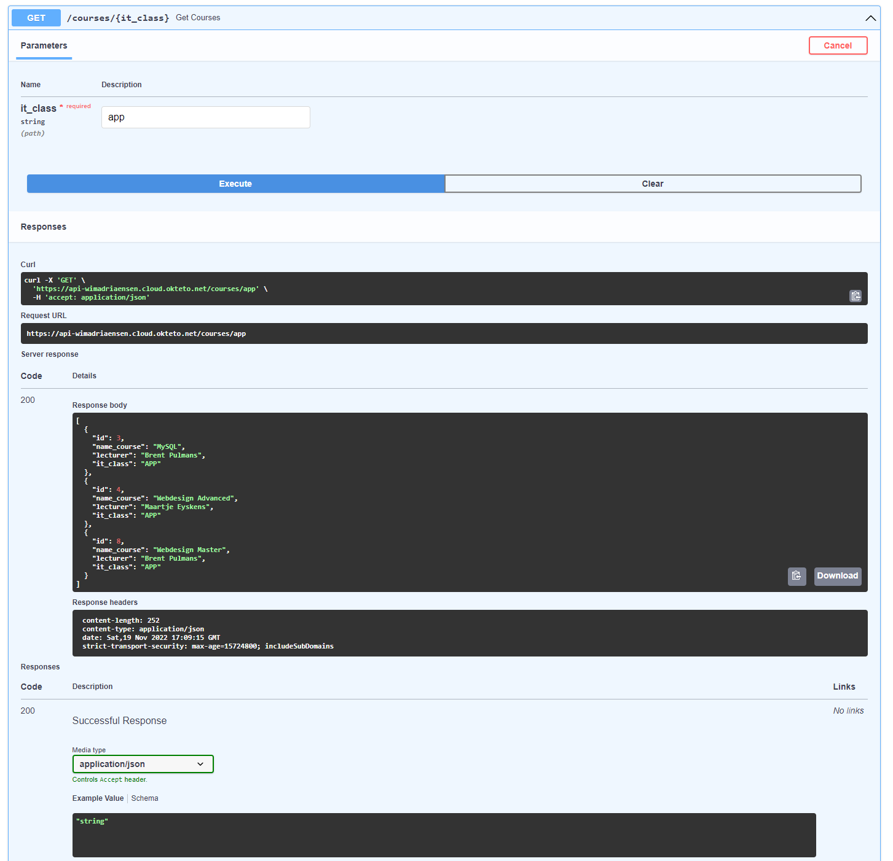
 

### Screenshot GET /maker
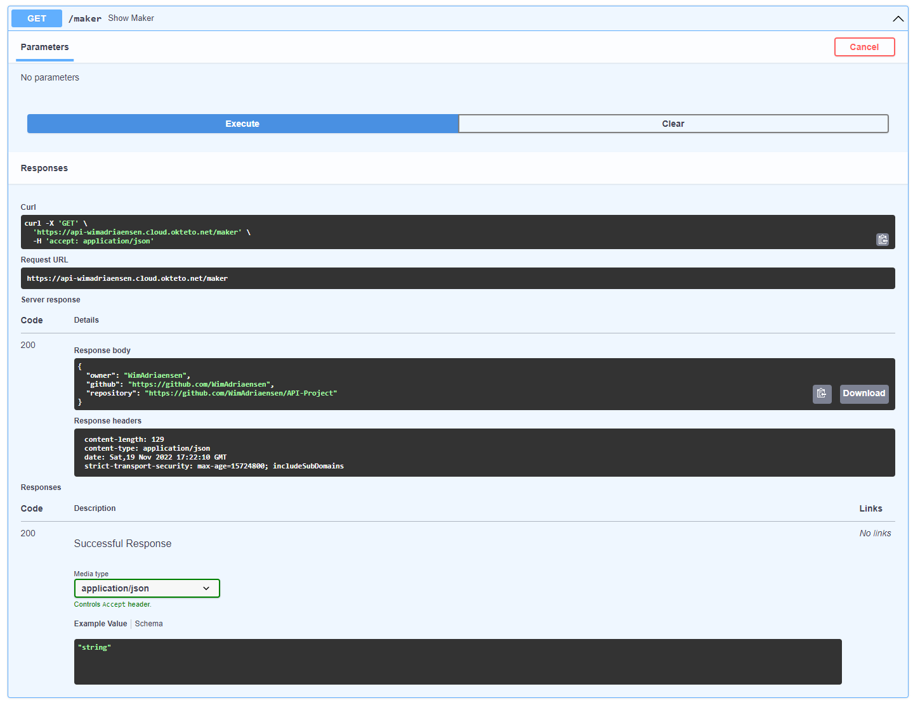
 
