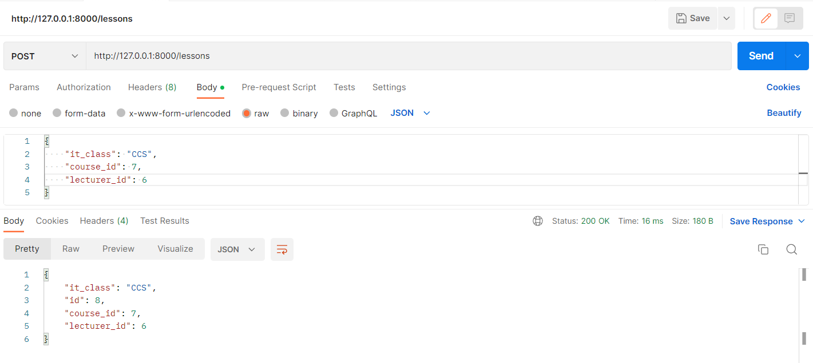
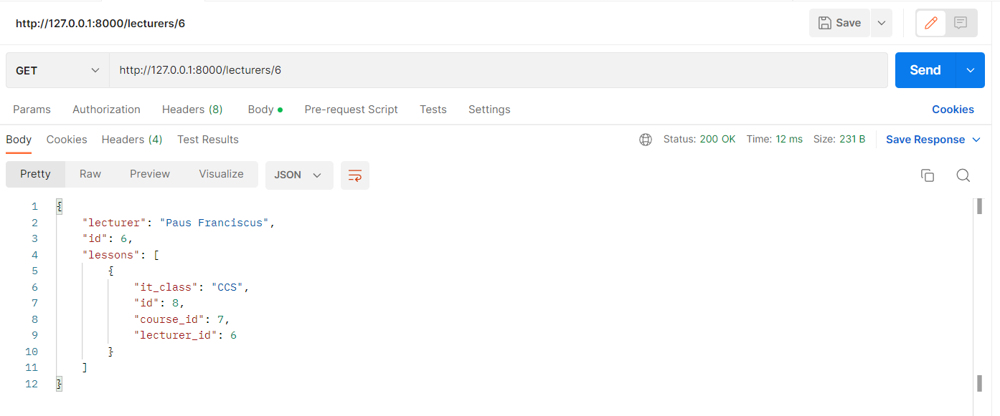

# Eindproject API Development
###### door Wim Adriaensen
## Beschrijving
### Gekozen thema
Het gekozen thema voor mijn API is een soort van Thomas More lessenrooster, waarbij je vakken en docenten kan koppelen in lessen voor een bepaalde richting.
Zo werk ik met een database voor deze API met een tabel voor de vakken (Courses), de docenten (Lecturers) en de lessen (Lessons). Het ERD ziet er als volgt uit.
 

 
In de tabel Courses zitten de vakken, in de tabel Lecturers zitten de docenten en in de tabel Lessons worden de vakken aan de docenten gekoppeld en voor welke richting (it_class) deze voorzien is (nog zonder datum en tijd). Ook is er een tabel Users aangemaakt voor authentication.
 

### Extra's 
#### 2.1 & 2.1.1 - Schrijven van tests voor alle endpoints
Ik heb test geschreven voor al de endpoints van de API zowel voor de GET- als voor de POST-, PUT-, en DELETE-requests.  

  

#### 3.2 - Gebruik van Grafana Cloud
Ik heb op Grafana een dashboard aangemaakt die data laat zijn die hij opvraagt van mijn API.  
het dashboard ziet er als volgt uit en word ook geupdatet bij veranderingen.   

  
Deze 3 panelen gebruiken elk een andere endpoint van de API, in Grafana heb ik dus ook 3 data sources voor mijn API, elke data source is een andere endpoint.   

  
Zo ziet een data source er in detail uit:   

  

#### Links

| Description | Link |
| --- | --- |
| Hosted API | https://api-wimadriaensen.cloud.okteto.net/ |
| Hosted front-end |   |
| Repository front-end |  |
 

# Werking API via Postman

#### Hieronder zijn enkele screenshots met de werking van de API met de applicatie Postman.  
## GET-Requests
 

### GET-request 1
De eerste screenshot is een GET-request van '/courses', deze vraagt de huidige lijst op van vakken. Als er reeds lessen zijn aangemaakt met deze vakken ziet u deze hier ook terug.

  

### GET-request 2
De volgende screenshot is opnieuw een GET-request, ditmaal van '/courses/{course_id}'. Deze endpoint van de API geeft het vak weer met de gegeven course_id. 

  

### GET-request 3
De Derde screenshot is een GET-request van '/lecturers', deze geeft de lijst met lecturers terug. Als er reeds lessen zijn aangemaakt met deze lecturers ziet u deze hier ook terug 

  

### GET-request 4
De volgende screenshot is een GET-request van '/lecturers/{lecturer_id}. Deze endpoint geeft de lecturer terug met de gegeven lecturer_id.  

  

### GET-request 5
De volgende screenshot is een GET-request van '/lessons', met deze request krijg je van de API een lijst met alle lessen terug.  

  

### GET-request 6 
Dit is een screenshot van het endpoint '/lessons/{lesson_id}', deze geeft de lesson terug met het id gelijk aan de gegeven lesson_id.  

  

### GET-request 7
De laatste GET-request is voor '/users', deze geeft een lijst terug met de aangemaakte users. Deze users worden gebruikt voor authentication.  

  

## POST-requests
 

### POST-request 1
De eerste screenshot van de POST-requests is van het endpoint '/courses'. Hier geef je de naam van de nieuwe course mee, deze word vervolgens onderaan de lijst met courses geplakt.  

  

### POST-request 2
De volgende screenshot is van een POST-request naar '/lecturers'. Hier geeft je de naam van de lecturer mee, welke dan word aangemaakt en onderaan de lijst gezet.  

  

### POST-request 3
De derde screenshot is er één van de POST-request naar '/lessons'. In deze request geef je de 'id' van de course mee die je wil koppelen aan de 'id' van de lecturer, ook geef je de naam van de richting (it_class) mee (bv. APP, CCS, IOT, ...). Hiervan word een lesson gemaakt en in de lijst met lessons gezet.  

  
Zo zien we dat de nieuwe lesson de nieuwe course aan de nieuwe lecturer koppelt voor de richting 'CCS'. Als we dan lecturer opvragen met het id in de lessen zien we dat de lesson bij hem is toegevoegd. (Dit zal ook het geval zijn bij de course).  

### POST-request 4
Dit is een screenshot van een POST-request naar '/users'. Met dit request maak je een nieuwe user aan die je kan gebruiken voor authenticatie.  

  

## PUT-requests
 

### PUT-request 1
Volgende screenshots zijn van een PUT-request om een aanpassing te doen van een 'lesson', dit kan via het endpoint '/updlesson/{lesson_id}', waarbij je de id van de lesson die je wil aanpassen meegeeft als 'lesson_id'.  
Ook geef je (net zoals bij de POST-request) de nieuwe waardes voor 'it_class', 'course_id' en 'lecturer_id' mee.  
 
GET-request van lesson met id '8':  

   
PUT-request van lesson met id '8':  

  

## DELETE-request
 

### DELETE-request 1
Volgende screenhot is van een DELETE-request naar '/delcourse/{course_id}'. Hiermee kan je een course deleten met het 'id' gegeven als 'course_id'.  
Als een course verwijderd wordt zullen ook de bijhorende lessen van deze course verwijderd worden.  

 
Zo zie je in de volgende screenshot dat de lesson voor lecturer 'Paus Franciscus' verdwenen is.  

  

### DELETE-request 2
Deze screenshot is van een DELETE-request naar '/dellecturer/{lecturer_id}'. Met dit endpoint kan je een lecturer met meegegeven id verwijderen, net zoals bij de delete-request hierboven, worden de de bijhorende lessons van de lecturer mee verwijderd.  

  
Als laatste zou ik nog graag willen vermelden dat wanneer je aan een request een id meegeeft die niet bestaat zal de API ook antwoorden dat hij de 'Course', 'Lesson' of 'Lecturer' niet heeft gevonden.  
Dit is bijvoorbeeld de response wanneer je de 'lecturer_id' opzoekt van de lecturer die we net verwijderd hebben.  

  

# Docs
#### Hier worden er enkele screenshots getoond van de endpoint '/docs' van de API.
link: https://api-wimadriaensen.cloud.okteto.net/docs
  

### Screenshot docs

 

### Screenshot GET /courses

 

### Screenshot POST /courses

 

### Screenshot GET /courses/{it_class}

 

### Screenshot GET /maker

 
